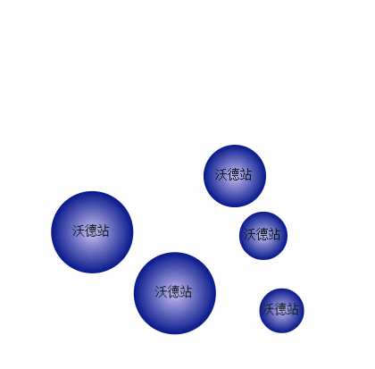

# README

### What is this ?

这是一个把小球碰撞特效封装起来的js文件。

### Usage

+ 在body中添加两个<code>canvas</code>标签
+ 分别设置不同的<code>id</code>
+ 在body底部引用核心文件ball.js
+ 在script标签中 <code>new Ball()</code>
+ 初始化<code>init</code>方法

### Quick Examples

请查看index.html文件

### Veiw

</img>